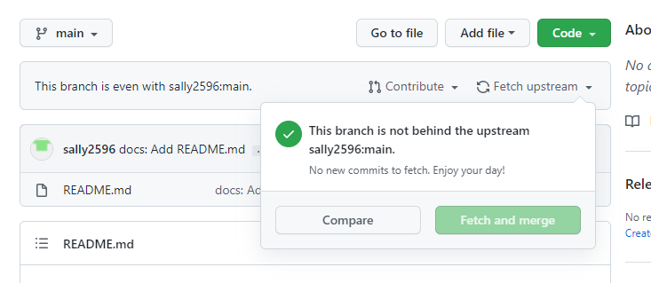

# Rules for Commit

## ✏️ Commit Message Rules

1. Commit 이전에 먼저 `upstream` repository와 동기화 해주세요.

   1. Git 홈페이지에서 진행할 경우

      `Fetch and merge` 클릭

      

   2. Command로 실행할 경우

      $ git pull upstream main

2. Commit Message는 `(type): (내용)`로 해주세요.

   > $ git commit -m feat: Add Login

   <aside>
   👉 **Type 유형**

   feat : 새로운 기능에 대한 커밋
   fix : 버그 수정에 대한 커밋
   build : 빌드 관련 파일 수정에 대한 커밋
   chore : 그 외 자잘한 수정에 대한 커밋
   ci : CI관련 설정 수정에 대한 커밋
   docs : 문서 수정에 대한 커밋
   style : 코드 스타일 혹은 포맷 등에 관한 커밋
   refactor : 코드 리팩토링에 대한 커밋
   test : 테스트 코드 수정에 대한 커밋

   </aside>
